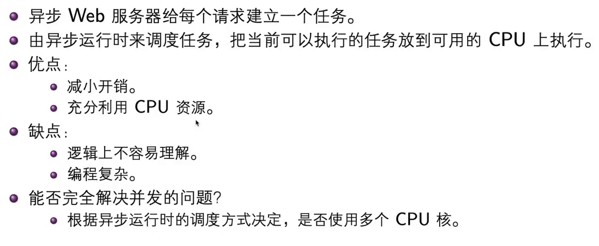
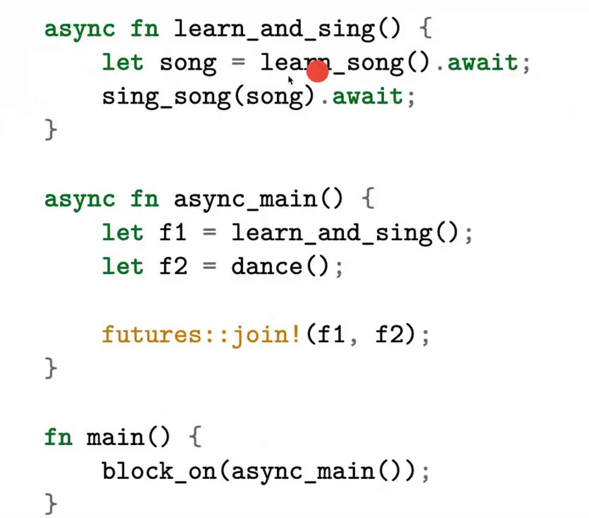

# IO与异步编程
异步可以提高CPU使用率。


## I/O
buffer是一个数组，因此可以读取的最大长度编码在类型信息中。


## 异步概念基础
背景：
异步编程时一个并发编程模型，异步编程允许我们同时运行大量的任务，却仅仅需要几个甚至一个OS线程或CPU核心，现代化的异步编程在使用体验上跟同步编程几乎无区别。

根据异步运行时的调度方式决定，是否使用多个CPU核。

并发模型：
* OS模型
* 事件驱动模型
* 协程
* actor模型
* async/await

少数线程支撑大量任务。可执行文件大（需要生成状态机，每个可执行文件捆绑一个异步运行时）

编写代码难度提高，调度需要一个过程。
## 异步基础
实现异步编程需要编程语言能够支持：
* 把一段代码变成异步任务
* 调度异步任务的执行

### 为什么使用async
async编程，是一种并发编程模型
* 允许你在少数系统线程上运行大量的并发任务
* 通过async/await语法，看起来和同步编程差不多

 async创建异步代码：
 * async fn返回的结果是一个future对象
 * 需要用执行器executor来执行Future对象

如何理解executor如何理解？
```rust
use futures::executor::block_on;

async fn hello_world() {
    println!("hello world");

}

fn main() {
    // Nothing is printed ,
    // 因为async创建一个任务，需要executor执行
    let future = hello_world();
    block_on(future); //这里future才执行，才会进行打印
}
```

### .await
* 可以使用.await来等待另外一个Future对象完成
* 不同于block_on，.await是异步等待，不阻塞当前线程，此时可以调度其他异步任务。

.await可以实现当前任务执行过程中调度出去，然后只要其他有可执行异步任务，就可以执行其他异步任务。
```rust
use futures::executor::block_on;

async fn hello_world() {
    hello_cat().await; //如果这里没有这个await，那么就会报错，因为这里返回的Future没有任何人执行它
    println!("hello, world!");
}

async fn hello_cat() {
    println!("hello, kitty!");
}
fn main() {
    let future = hello_world();
    block_on(future);
}
```
两种解决方法：使用.await语法或者对Future进行轮询(poll)。
为hello_cat()添加上.await后，结果立刻大为不同:

hello, kitty!
hello, world!
输出的顺序跟代码定义的顺序完全符合，因此，我们在上面代码中使用同步的代码顺序实现了异步的执行效果，非常简单、高效，而且很好理解，未来也绝对不会有回调地狱的发生。

总之，在async fn函数中使用.await可以等待另一个异步调用的完成。但是与block_on不同，.await并不会阻塞当前的线程，而是异步的等待Future A的完成，在等待的过程中，该线程还可以继续执行其它的Future B，最终实现了并发处理的效果。

[Rust语言圣经](https://course.rs/advance/async/getting-started.html)

#### 异步调用


* 如何理解async，await等关键字实现及原理？
* block_on? 强制执行async函数
* future::join!(f1,f2); 可以执行f1和f2任意一个。并发执行过程
* executor决定哪个执行

```rust

// `foo()` returns a type that implements `Future<Output = u8>`.
// `foo().await` will result in a value of type `u8`.
async fn foo() -> u8 { 5 }

fn bar() -> impl Future<Output = u8> {
    // This `async` block results in a type that implements
    // `Future<Output = u8>`.
    async {
        let x: u8 = foo().await;
        x + 5
    }
}
```

async有两种语法：
* async fn将一个函数转换为异步函数，返回future对象
* async 放在代码前面，将代码段转换为异步任务，也返回Future对象

需要注意于async相关的所有权和生命周期的问题。

## Future

```rust
trait Future {
    type Output;
    fn poll(
        // Note the change from `&mut self` to `Pin<&mut Self>`:
        self: Pin<&mut Self>, //看作future自己
        // and the change from `wake: fn()` to `cx: &mut Context<'_>`:
        cx: &mut Context<'_>, // future上下文，带上唤醒的操作等
    ) -> Poll<Self::Output>;
}

enum Poll<T> {
    Ready(T),
    Pending,
}
```
* Future特型是Rust异步编程的核心
* Future对象是一项异步计算任务，能够返回一个结果，有可能中间会停顿断开，切换任务。

Future代表着一种你可以检验其是否完成的操作，Future可以通过调用poll函数来取地进展
* poll函数会驱动Future尽可能接近完成
* 如果Future完成了：就返回poll::Ready(result),其中result就是最终的结果。
* 如果Future还无法完成：就返回poll::Pending,并当Future准备好取得更多进展时调用一个waker的wake()函数

针对Future，你唯一能做的就是使用poll来敲打它，直到一个值掉出来。

## 用waker唤醒任务
* Waker提供了wake方法，它可以被用来告诉执行者：相关的任务应该被唤醒
* 当wake()被调用，执行者知道Waker所关联的任务已经准备好取得更多进展，Future应该被再次poll
* Waker实现了clone(),可以复制和存储。


## 执行器的视角

执行器维护一组顶级的Future对象，当他们有进展时，调用poll方法来推动运行
通常是维护一个队列，表示当前正在运行的Future对象
* 当Future对象运行返回Pending状态时，将它移出队列
* 当Future对象相关的wake()方法被调用时，将可以运行的Future对象放回队列

个人理解：一旦wake，就可以poll，一旦pending，就进行等待或者休眠。

### 多线程执行异步任务
* 当使用多线程执行器时，Future对象可能在线程之间转移，因此async中用到的变量必须时Send的。也就是Future内部的变量等都需要send实现。
* std::sync::Mutex可能会引起死锁，使用futures::lock::Mutex;

future对象或者内部的代码使用mutex可能引起死锁！！！-->线程之间的转移存在！！！

## 异步生态
rust语言的重要的缺失： 就是执行器。
执行器可以做：调度策略、执行控制。
执行器由第三方实现：

### 异步运行时
包含：
* 一个反应器（reactor），提供对外部时间的监听机制（如IO、过程间通信、计时器等）
* 一个或多个执行器，处理任务的调度和执行。
运行时需要做的事情包括：
* 维护当前正在运行和挂起的任务
* 查询任务的进展
* 唤醒任务，推动任务执行

#### Futures库
futures 库包含可用于编写异步代码的 trait 和功能。这包括 Stream，Sink，AsyncRead 和 AsyncWrite trait，以及诸如组合器的实用工具。这些实用工具和 trait 最终可能成为标准库的一部分。

futures 有它自己的执行器，但没有自己的反应器，所以它不支持异步I/O或计时器 futures 的执行。因为这个原因，它不被视为一个完整的运行时。一个常见的选择是将futures 中的实用工具与另一个库中的执行器一起使用。


#### 主流的异步运行时
标准库中没有异步运行时，官方也没有建议这样做。下面列举的库提供了主流的运行时。

* Tokio：一个具有HTTP，gRPC和跟踪框架的主流异步生态系统。
* async-std：一个提供标准库组件级别的库。
* smol：一个小且简单的异步运行时。提供可用于包装 UnixStream 或 TcpListener 此类的结构的 Async trait。
* fuchsia-async：在Fuchsia操作系统中使用的执行器。

## Tokio库

适合来写网络服务端代码：
* 执行异步代码的多线程运行时；
* 标准库的异步版本
* 由很多相关库组成的生态系统

tokio创建共享状态：

```rust
use tokio::net::TcpListener;
use std::collections::HashMap;
use std::sync::{Arc, Mutex};

#[tokio::main]
async fn main() {
    let listener = TcpListener::bind("127.0.0.1:6379").await.unwrap();

    println!("Listening");

    let db = Arc::new(Mutex::new(HashMap::new()));

    loop {
        let (socket, _) = listener.accept().await.unwrap();
        // 将 handle 克隆一份
        let db = db.clone();

        println!("Accepted");
        tokio::spawn(async move {
            process(socket, db).await;
        });
    }
}
```
可以详细学习：https://zhuanlan.zhihu.com/p/461874095

### Tokio中的通道
mpsc：
oneshot：一个异步任务传递到另一个异步任务的消息
broadcast：
watch：

### 异步IO

## 使用异步的场景和得失
* 任务的类型
* 编程的难度

IO和CPU计算平衡？
代码量比同步编写难度？
异步代码如何调试？足够的日志信息，进行日志记录。多线程本身就不靠谱，其他线程怎么处理呢？
操作系统内核调式？用户态内核态切换？需要日志打印。

